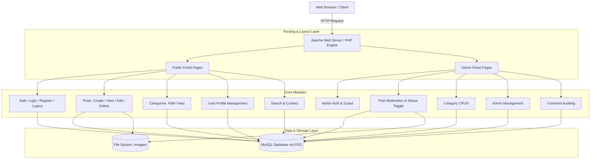
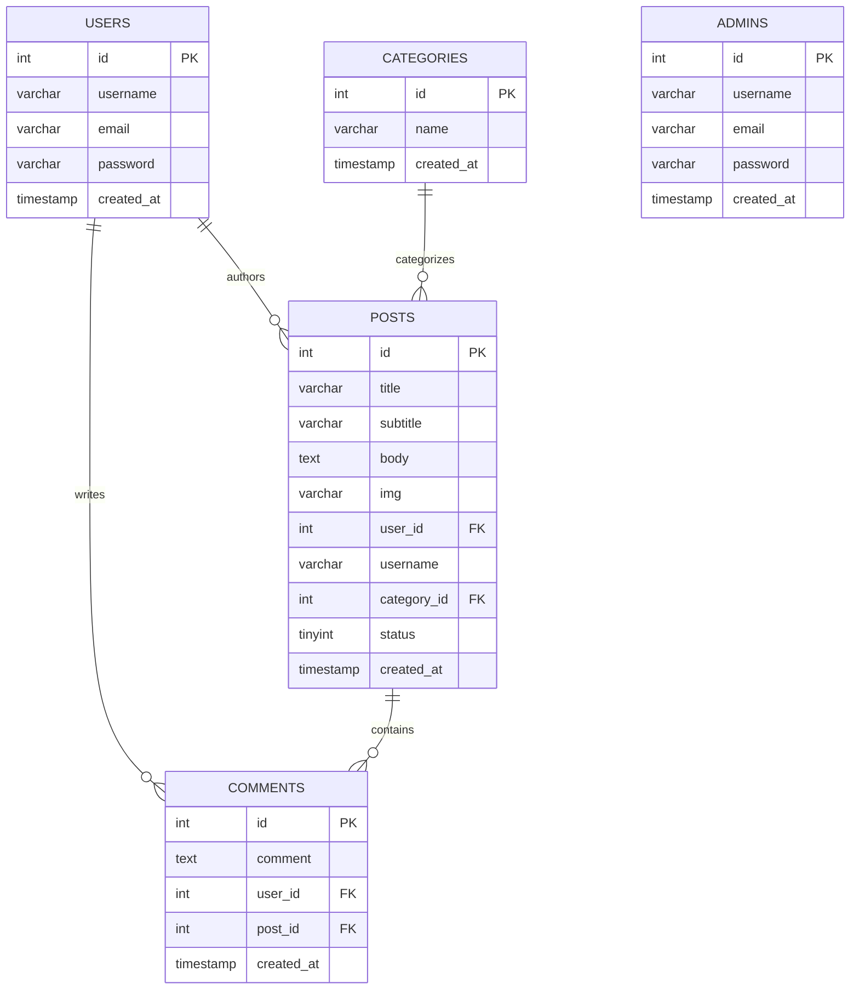

# 📝 Clean Blog CMS - PHP & MySQL

[](https://www.php.net/)
[](https://www.mysql.com/)
[](https://getbootstrap.com/)
[](https://httpd.apache.org/)
[](LICENSE)

> A modular, responsive Content Management System (CMS) and blogging platform built with vanilla **PHP (PDO)** and **MySQL**, featuring role-separated authentication, dynamic content publishing, category classification, comment threads, search indexing, and a dedicated administrative back-office.

---

## 📑 Table of Contents

- [Overview & Architecture](#-overview--architecture)
- [Key Features](#-key-features)
  - [Public Client Portal](#public-client-portal)
  - [Administrative Back-Office](#administrative-back-office)
- [Directory Structure](#-directory-structure)
- [Tech Stack Breakdown](#-tech-stack-breakdown)
- [Database Architecture & Schema](#-database-architecture--schema)
- [Installation & Getting Started](#-installation--getting-started)
  - [Prerequisites](#prerequisites)
  - [Step-by-Step Setup](#step-by-step-setup)
  - [Configuration](#configuration)
- [Usage & Operational Workflow](#-usage--operational-workflow)
- [Security & Architecture Analysis](#-security--architecture-analysis)
- [License & Credits](#-license--credits)

---

## 🏛 Overview & Architecture

**Clean Blog CMS** is structured as a classical Server-Side Rendered (SSR) Multi-Page Application (MPA). It cleanly decouples public-facing readers/authors from backend administrators through distinct presentation templates and session-scoped access controls.



---

## ✨ Key Features

### Public Client Portal
- **User Authentication**: Secure user registration and login utilizing native PHP password hashing (`password_hash` with `PASSWORD_DEFAULT` and `password_verify`).
- **Post Lifecycle Management**: Authenticated users can create, read, update, and delete their own blog articles with image upload support.
- **Categorization**: Multi-category tagging with category-specific filtering feeds.
- **Interactive Comment System**: Threaded comments under blog posts linking author identities and timestamps.
- **Dynamic Search Engine**: Full-text `LIKE` search query filter matching post titles and active publication status.
- **User Profile Management**: Update user account credentials and profile metadata.
- **Responsive Theme**: Integrated **Clean Blog** responsive Bootstrap 5 theme with floating sticky navbar dynamics and mobile drawer navigation.

### Administrative Back-Office
- **Dedicated Admin Authentication**: Separate credentials and authentication pipeline for platform administrators.
- **Dashboard Analytics**: Real-time counter metrics aggregating total posts, categories, and registered administrators.
- **Post Moderation**: Content publishing control allowing administrators to toggle article visibility (`Active (1)` vs. `Inactive (0)`) and remove non-compliant content.
- **Category Management**: Full CRUD capabilities for creating, renaming, and removing taxonomy categories.
- **Comment Audit Log**: Centralized inspection table monitoring user interaction across posts.
- **Administrator Provisioning**: Interface for authorized superusers to provision new administrators.

---

## 📂 Directory Structure

```text
blog-cms-php/
├── 404.php                     # Custom animated 404 Not Found error page
├── contact.php                 # Contact page with StartBootstrap forms UI
├── index.php                   # Homepage feed (displays active posts & category list)
├── search.php                  # Post search engine interface & results
├── config/
│   └── config.php              # Centralized PDO Database connection & settings
├── includes/
│   ├── header.php              # Global HTML top layout & masthead banner
│   ├── navbar.php              # Global navigation bar & session state check
│   └── footer.php              # Global footer, social links & JS bundle scripts
├── auth/
│   ├── login.php               # Member authentication login handler
│   ├── logout.php              # User session termination & cleanup
│   └── register.php            # New user account registration
├── categories/
│   └── category.php            # Category-specific post filter archive
├── posts/
│   ├── create.php              # Blog post authoring & image upload
│   ├── delete.php              # Post deletion & image filesystem cleanup
│   ├── post.php                # Single post view & comment submission
│   └── update.php              # Post editor & image replacement handler
├── users/
│   └── profile.php             # User profile viewing and profile updater
├── admin-panel/
│   ├── index.php               # Admin dashboard overview & analytics counters
│   ├── admins/
│   │   ├── admins.php          # Admin user list table
│   │   ├── create-admins.php   # Admin account registration form
│   │   ├── login-admins.php    # Admin authentication entry point
│   │   └── logout-admins.php   # Admin session cleanup
│   ├── categories-admins/
│   │   ├── create-category.php # Category creation form
│   │   ├── delete-category.php # Category removal handler
│   │   ├── show-categories.php # Category inventory list
│   │   └── update-category.php # Category rename editor
│   ├── comments-admins/
│   │   └── show-comments.php   # Comment moderation audit view
│   ├── layouts/
│   │   ├── header.php          # Admin panel top navigation & sidebar layout
│   │   └── footer.php          # Admin panel layout closure & scripts
│   ├── posts-admins/
│   │   ├── delete-posts.php    # Admin post deletion handler
│   │   ├── show-posts.php      # Admin post inventory & status toggle table
│   │   └── status-posts.php    # Post activation toggle controller (0/1)
│   └── styles/
│       └── style.css           # Custom CSS for admin sidebar & dashboard
├── assets/
│   ├── favicon.ico             # Site favicon
│   └── img/                    # Default layout backgrounds (home, about, contact)
├── css/
│   └── styles.css              # Start Bootstrap Clean Blog core stylesheet
├── images/                     # Upload directory for post featured images
└── js/
    └── scripts.js              # Navbar scroll-behavior & dynamic interaction scripts
```

---

## 🛠 Tech Stack Breakdown

| Component | Technology | Description |
| :--- | :--- | :--- |
| **Backend Language** | **PHP 7.4 / 8.x** | Procedural & OOP server-side application logic |
| **Database Engine** | **MySQL 5.7+ / MariaDB** | Relational Database Management System |
| **Database Access** | **PDO (PHP Data Objects)** | Prepared statements with parameterized queries |
| **Frontend (Client)** | **Bootstrap 5.1.3 + Vanilla JS** | Modern, responsive public client interface |
| **Frontend (Admin)** | **Bootstrap 4.0.0 + jQuery** | Dashboard layout with collapsible sidebar |
| **Typography & Icons**| **Google Fonts & FontAwesome 6** | *Lora*, *Open Sans*, and FontAwesome icon suite |
| **Server Environment** | **Apache 2.4+ (XAMPP / LAMP)** | HTTP Server with `mod_rewrite` & PHP module |

---

## 🗄 Database Architecture & Schema

### Entity-Relationship Overview



### SQL Initialization Script

Execute the following SQL script in your MySQL client (e.g. phpMyAdmin, MySQL Workbench, or CLI) to set up the `cleanblog` database:

```sql
CREATE DATABASE IF NOT EXISTS `cleanblog` DEFAULT CHARACTER SET utf8mb4 COLLATE utf8mb4_unicode_ci;
USE `cleanblog`;

-- --------------------------------------------------------
-- Table structure for `users`
-- --------------------------------------------------------
CREATE TABLE IF NOT EXISTS `users` (
  `id` INT(11) NOT NULL AUTO_INCREMENT,
  `email` VARCHAR(255) NOT NULL UNIQUE,
  `username` VARCHAR(100) NOT NULL,
  `password` VARCHAR(255) NOT NULL,
  `created_at` TIMESTAMP NOT NULL DEFAULT CURRENT_TIMESTAMP,
  PRIMARY KEY (`id`)
) ENGINE=InnoDB DEFAULT CHARSET=utf8mb4;

-- --------------------------------------------------------
-- Table structure for `admins`
-- --------------------------------------------------------
CREATE TABLE IF NOT EXISTS `admins` (
  `id` INT(11) NOT NULL AUTO_INCREMENT,
  `username` VARCHAR(100) NOT NULL,
  `email` VARCHAR(255) NOT NULL UNIQUE,
  `password` VARCHAR(255) NOT NULL,
  `created_at` TIMESTAMP NOT NULL DEFAULT CURRENT_TIMESTAMP,
  PRIMARY KEY (`id`)
) ENGINE=InnoDB DEFAULT CHARSET=utf8mb4;

-- --------------------------------------------------------
-- Table structure for `categories`
-- --------------------------------------------------------
CREATE TABLE IF NOT EXISTS `categories` (
  `id` INT(11) NOT NULL AUTO_INCREMENT,
  `name` VARCHAR(100) NOT NULL,
  `created_at` TIMESTAMP NOT NULL DEFAULT CURRENT_TIMESTAMP,
  PRIMARY KEY (`id`)
) ENGINE=InnoDB DEFAULT CHARSET=utf8mb4;

-- --------------------------------------------------------
-- Table structure for `posts`
-- --------------------------------------------------------
CREATE TABLE IF NOT EXISTS `posts` (
  `id` INT(11) NOT NULL AUTO_INCREMENT,
  `title` VARCHAR(255) NOT NULL,
  `subtitle` VARCHAR(255) NOT NULL,
  `body` TEXT NOT NULL,
  `img` VARCHAR(255) NOT NULL,
  `user_id` INT(11) NOT NULL,
  `username` VARCHAR(100) NOT NULL,
  `category_id` INT(11) NOT NULL,
  `status` TINYINT(1) NOT NULL DEFAULT 1,
  `created_at` TIMESTAMP NOT NULL DEFAULT CURRENT_TIMESTAMP,
  PRIMARY KEY (`id`),
  INDEX (`user_id`),
  INDEX (`category_id`),
  CONSTRAINT `fk_posts_users` FOREIGN KEY (`user_id`) REFERENCES `users` (`id`) ON DELETE CASCADE,
  CONSTRAINT `fk_posts_categories` FOREIGN KEY (`category_id`) REFERENCES `categories` (`id`) ON DELETE CASCADE
) ENGINE=InnoDB DEFAULT CHARSET=utf8mb4;

-- --------------------------------------------------------
-- Table structure for `comments`
-- --------------------------------------------------------
CREATE TABLE IF NOT EXISTS `comments` (
  `id` INT(11) NOT NULL AUTO_INCREMENT,
  `comment` TEXT NOT NULL,
  `user_id` INT(11) NOT NULL,
  `post_id` INT(11) NOT NULL,
  `created_at` TIMESTAMP NOT NULL DEFAULT CURRENT_TIMESTAMP,
  PRIMARY KEY (`id`),
  INDEX (`user_id`),
  INDEX (`post_id`),
  CONSTRAINT `fk_comments_users` FOREIGN KEY (`user_id`) REFERENCES `users` (`id`) ON DELETE CASCADE,
  CONSTRAINT `fk_comments_posts` FOREIGN KEY (`post_id`) REFERENCES `posts` (`id`) ON DELETE CASCADE
) ENGINE=InnoDB DEFAULT CHARSET=utf8mb4;

-- --------------------------------------------------------
-- Initial Seed Data (Optional)
-- --------------------------------------------------------
INSERT INTO `categories` (`id`, `name`) VALUES
(1, 'Technology'),
(2, 'Design'),
(3, 'Lifestyle'),
(4, 'Programming');
```

---

## 🚀 Installation & Getting Started

### Prerequisites
- **Web Server**: Apache (XAMPP, WampServer, MAMP, or LAMP stack).
- **PHP**: Version `7.4` or `8.0+` with `pdo_mysql` and `gd`/`fileinfo` extensions enabled.
- **Database**: MySQL `5.7+` or MariaDB `10.4+`.
- **Git**: For source version control.

### Step-by-Step Setup

1. **Clone the Repository** into your web server's root directory (`htdocs` for XAMPP or `/var/www/html` for LAMP):
   ```bash
   cd C:/xampp/htdocs
   git clone https://github.com/baohuy2209/blog-cms-php.git
   ```

2. **Start Web Server & Database**:
   - Open the **XAMPP Control Panel** and start both **Apache** and **MySQL**.

3. **Database Provisioning**:
   - Navigate to `http://localhost/phpmyadmin`.
   - Create a database named `cleanblog`.
   - Import the [SQL Initialization Script](#sql-initialization-script) above in the SQL tab.

4. **Configure Database Connection**:
   - Open `config/config.php` and adjust your database credentials:
   ```php
   <?php 
       try {
           $host = "localhost"; 
           $dbname = "cleanblog";
           $user = "root"; 
           $pass = ""; // Enter your MySQL password (default is empty for standard XAMPP)
       
           $conn = new PDO("mysql:host=$host;dbname=$dbname", $user, $pass); 
           $conn->setAttribute(PDO::ATTR_ERRMODE, PDO::ERRMODE_EXCEPTION);
       } catch (PDOException $e) {
           echo "Connection failed: " . $e->getMessage();
       }
   ?>
   ```

5. **Verify Base URL Constants**:
   - Client Portal URL in `includes/navbar.php`:
     ```php
     define('APPURL', "http://localhost/blog-cms-php");
     ```
   - Admin Panel URL in `admin-panel/layouts/header.php`:
     ```php
     define('ADMIN_URL', "http://localhost/blog-cms-php/admin-panel");
     ```

6. **Ensure Image Upload Directory Permissions**:
   - Ensure the `images/` folder exists in the project root and is writable by the web server process:
     ```bash
     chmod 775 images/
     ```

7. **Launch the Application**:
   - Public Client Interface: `http://localhost/blog-cms-php/index.php`
   - Administrative Back-Office: `http://localhost/blog-cms-php/admin-panel/admins/login-admins.php`

---

## 💡 Usage & Operational Workflow

### 1. User Registration & Article Publishing
1. Navigate to **Register** (`/auth/register.php`) and submit your username, email, and password.
2. Sign in via **Login** (`/auth/login.php`).
3. Click on **Create** in the navigation bar (`/posts/create.php`).
4. Select a category, fill in the title, subtitle, markdown/text body, upload a banner image, and submit.
5. The post will be saved and rendered on the home feed.

### 2. Administrator Access & Moderation
1. Create the first admin directly or through the database:
   ```sql
   -- Insert default admin (Password: admin123)
   INSERT INTO `admins` (`username`, `email`, `password`) 
   VALUES ('admin', 'admin@cleanblog.local', '$2y$10$e8ix4vD.qL7dK0w/2mJ1EOnO0c8.K1l57Jsqf5uRkE4U0Jb5M2eTe');
   ```
2. Navigate to `http://localhost/blog-cms-php/admin-panel/admins/login-admins.php`.
3. Monitor analytics metrics on the main dashboard (`/admin-panel/index.php`).
4. Access **Posts** (`/admin-panel/posts-admins/show-posts.php`) to toggle post statuses between `Active` and `Inactive` or delete content.
5. Access **Categories** (`/admin-panel/categories-admins/show-categories.php`) to create or edit category names.

---

## 🔒 Security & Architecture Analysis

| Domain | Current Implementation | Recommended Production Enhancement |
| :--- | :--- | :--- |
| **Authentication** | BCrypt via `password_hash(..., PASSWORD_DEFAULT)` | Implement Argon2id hashing and password complexity policies. |
| **Database Queries** | Prepared statements (`PDO::prepare`) on post/user updates | Upgrade dynamic `SELECT` in search & admin login to parameterized bindings. |
| **Form Protection** | Basic empty input validation | Implement CSRF token verification middleware on all `POST` forms. |
| **File Uploads** | Basic file name verification & `move_uploaded_file` | Enforce MIME-type verification (e.g., `finfo`), random UUID file renaming, and max file size limits. |
| **Configuration** | Hardcoded credentials in `config/config.php` | Extract sensitive values into a `.env` file using `vlucas/phpdotenv`. |
| **URL Rewriting** | Native `.php` extension paths | Implement `.htaccess` / Apache `mod_rewrite` for Clean RESTful URLs. |

---

## 📄 License & Credits

- **Author**: Nguyen Bao Huy ([baohuy2209](https://github.com/baohuy2209))
- **Template Source**: [Start Bootstrap - Clean Blog](https://startbootstrap.com/theme/clean-blog) (MIT License)
- **License**: This project is licensed under the [MIT License](LICENSE).
